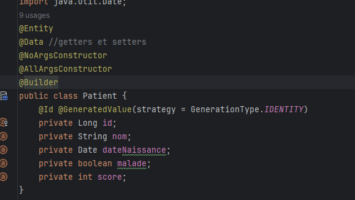

<h3>COMPTE RENDU TP3 P1</h3>
<h4>Patient Entity</h4>

<h4>Ajout de Patients</h4>
<h5>1/ Avec l'objet</h5>

<h5>2/ Avec le constructeur</h5>

<h5>3/ Avec le builder</h5>

<h4>Base de donnees H2</h4>

<h4>Base de donnees MySql</h4>

<h4>Controller liste patients</h4>

<h4>Liste patients</h4>
<h5>1/ Liste des patients</h5>

<h5>2/Code html</h5>

<h4>Pagination</h4>
<h5>1/ Controller</h5>

<h5>2/ Html</h5>

<h5>3/ Page web </h5>
<h6>3.1/ Limitation du nombre de patients</h6>

<h6>3.2/ Insertion du nb de la page et de la taille</h6>

<h6>3.3/ Affichage de numerotation des pages</h6>

<h4>Recherche Patient</h4>
<h5>1/ Controller</h5>

<h5>2/ Html</h5>

<h5>3/ Repository</h5>

<h5>4/ Page web</h5>

<h4>Supprimer Patient</h4>
<h5>1/ Controller</h5>

<h5>2/ Page Web</h5>

<h5>3/ Html</h5>

<h6>Pop-up</h6>

